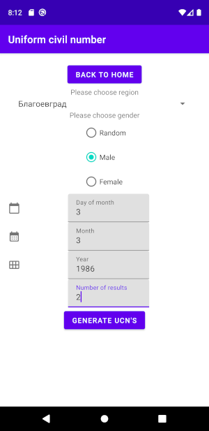

# Uniform civil numbers validation and generation tool

With this android application you can generate, validate and parse 
(get information for) Bulgarian [Unique citizenship numbers](https://en.wikipedia.org/wiki/Unique_citizenship_number). 
This is my "practice on your own" stage  on [this](https://developer.android.com/codelabs/basic-android-kotlin-training-tip-calculator#10) android development course,
so  it works properly, but I am not pretending it to be ideal. :) [Here](https://www.tiktok.com/@georgenaumov915/video/7052247360138808582) you 
can watch a short demonstration video. UniformCivilNumber class contains an algorithm from [https://georgi.unixsol.org/programs/egn.php](https://georgi.unixsol.org/programs/egn.php) 
which I ported from PHP to Kotlin. The author of the algorithm is Georgi Chorbadzhiyski. 

## Screenshots

|  |  |  |
|  |  | 